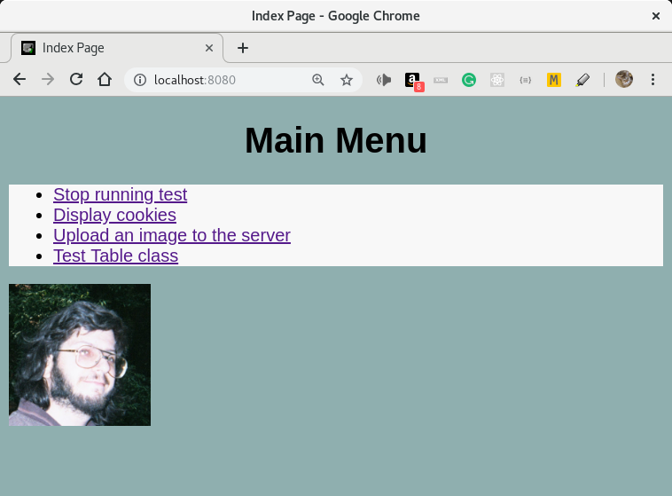

# README

`muHTTPDd` is a simple webserver written for wxWidgets. It is useful for web apps written in C++ which need to serve static HTTP documents.

Handles minimal HTTP/1.1 protocol GET/POST methods.

* Added *logging* features.                 (DONE)
* Added handling of *headers*.              (DONE)
* Added handling of *cookies*.              (DONE)
* Added handling of *Javascript*.           (DONE)
* Created *static library*                  (DONE)
* Renamed project from myHTTPd to muHTTPd.  (DONE)

## TODO
----

* Complete CSS styles for pages.
* Complete HTML table implementation.
* Provide special classes for each page type.
* Implement basic session system.

## Environment

The myHTTPd project was developed using the Code::Blocks IDE and the wxWidgets
cross-platform GUI library.

## Building the Project

    git clone https://github.com/muman613/muHTTPd
    cd libmuHTTPd
    make -j X # Set X to the # of processes to use to build
    cd ../muHTTPdemo
    make -j X # Set X to the # of processes to use to build
    ./bin/Release/muHTTPdemo

This will start the HTTP server running. Open a web-browser on your machine and navigate to http://localhost:8080 and you should see the demo web page. 

## Display of the muHTTPdemo

